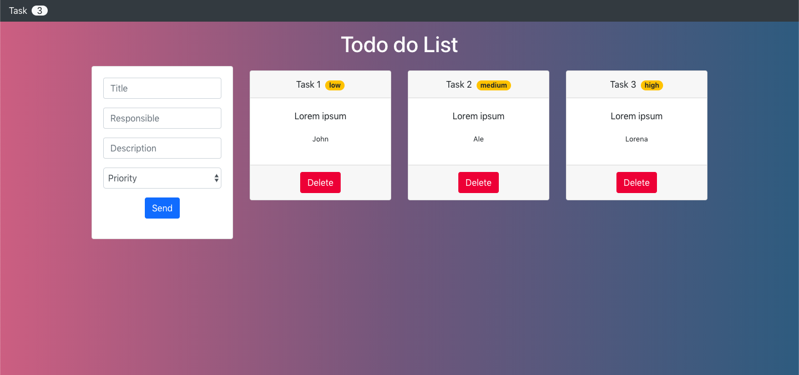

## React JS Basic - Todo list App

This project was bootstrapped with [Create React App](https://github.com/facebook/create-react-app).

## Requirements

* [node.js](https://nodejs.org) >=v 10.16.0 (lts)
* [yarn](http://yarnpkg.com)

# Setup

- `$ yarn`
- `$ yarn start` runs the app in development mode
- Open [http://localhost:3000](http://localhost:3000) to view it in the browser

# Build

- `$ yarn`
- `$ yarn build` generate dist files

# Example

